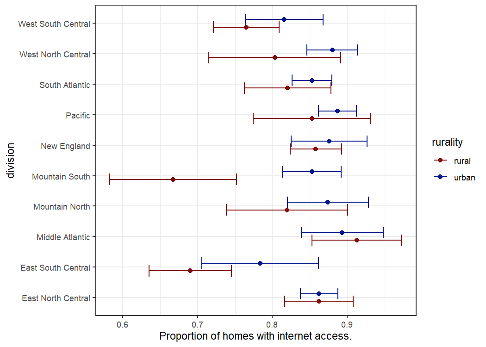
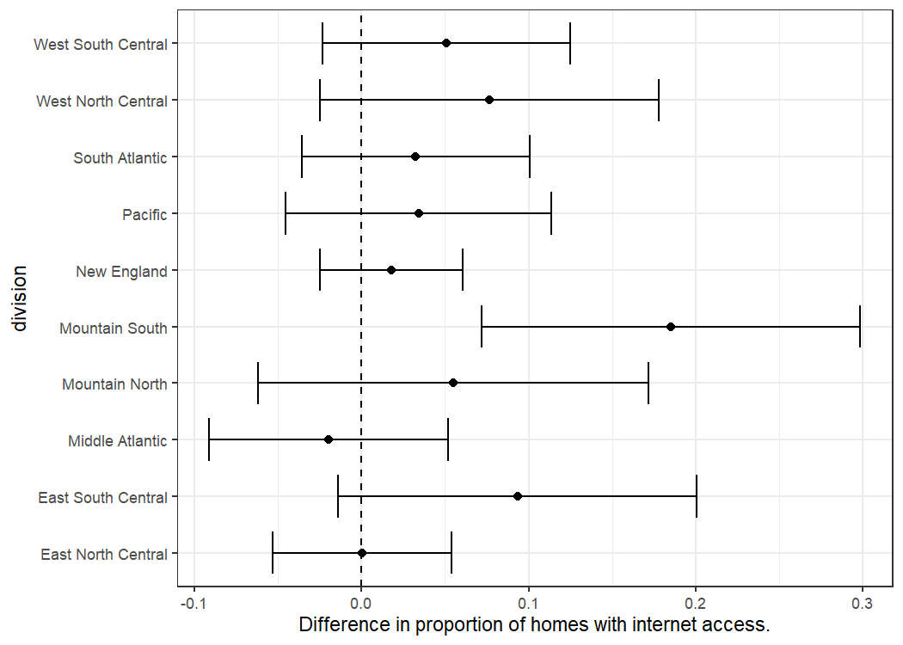

# Activities  

* Week 1 ([Specifications](https://github.com/jbhender/Stats506_F20/tree/master/activities/week1))
  * week1_part1.sh
    * takes in no arguments
    * downloads the [RECS data](https://www.eia.gov/consumption/residential/data/2015/index.php?view=microdata)
    * extracts specified variables (columns)
    * stores the extracted variables to `recs_brrweights.csv`
  * cutnames.sh: 
    * takes two arguments, `file` and `pattern`
    * returns the extracted columns (output path specified elsewhere)

* Week 4 ([Specifications](https://github.com/jbhender/Stats506_F20/tree/master/activities/week4))
  * Part 2 (ggplot2)
      
      

