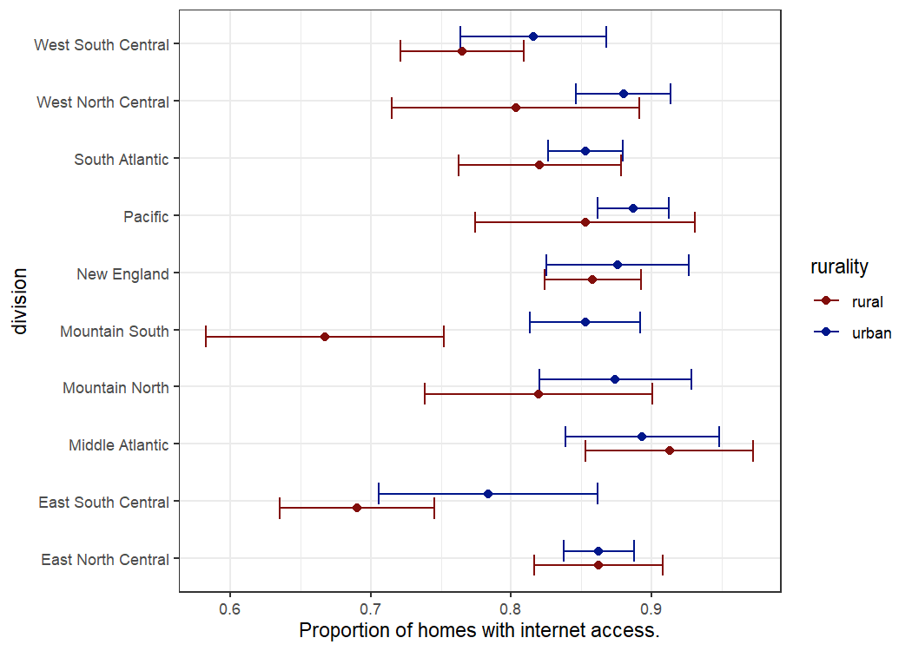
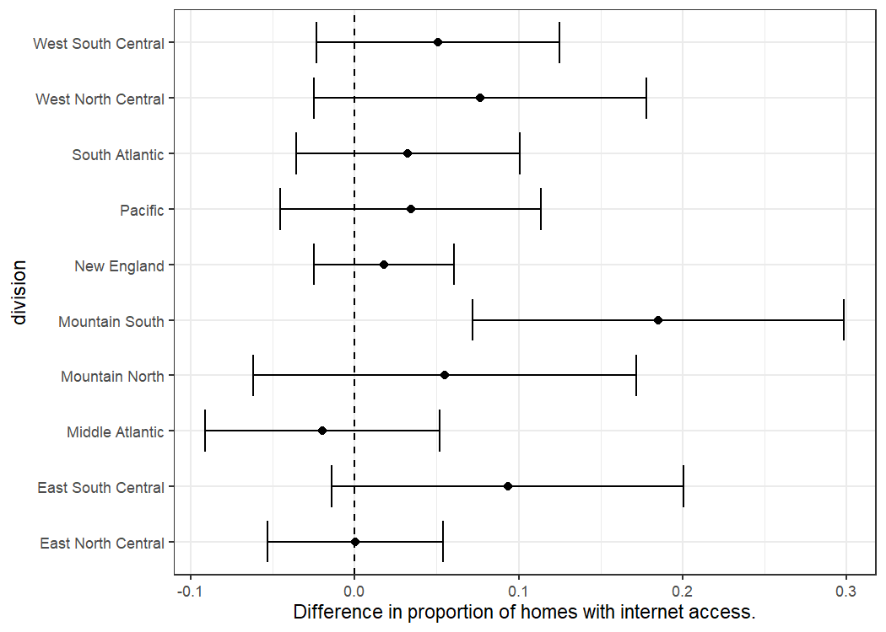

## Part 1 (dplyr)
Input data: R dataset `Orange`  

## Part 2 (ggplot2)  
Input data: w4_p2_RECS2015_internet.csv ([link](https://github.com/jbhender/Stats506_F20/blob/master/activities/week4/w4_p2_RECS2015_internet.csv))  

### Question 1  
  
### Question 2  
  
